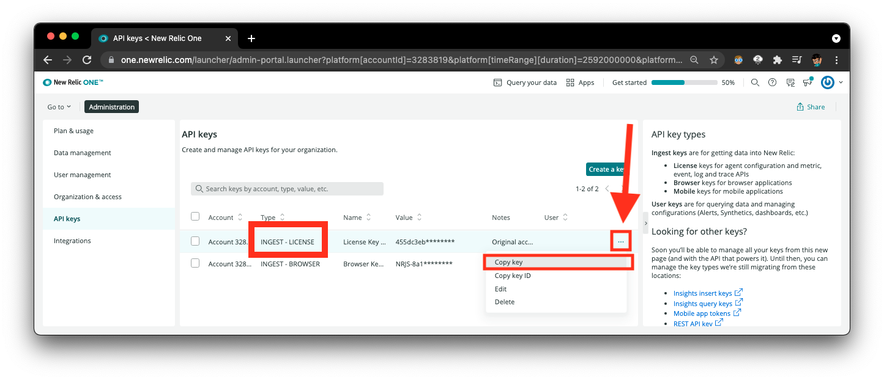

[](https://opensource.newrelic.com/oss-category/#new-relic-experimental)

# Gatsby Build Newrelic

Using Gatsby to deliver large websites can speed up end users’ experiences. However, as those projects scale, many development teams are slowed down by long build times. The `gatsby-build-newrelic` plugin provides instant observability into the entire Gatsby build process, exporting vital telemetry data from within the belly of the beast. With events, metrics, logs, and traces, we are able to contextualize and identify performance issues within our plugins, 3rd party APIs, and other parts of our website.

## Getting Started
### Account Setup and Required Variables

1. If you don't already have a New Relic account, [sign-up for our free forever tier - no credit-card required!](https://newrelic.com/signup?utm_source=jamstackconf&utm_medium=organic_social&utm_campaign=global-fy22-q2-gatsby_build&utm_content=event)

2. Go to https://one.newrelic.com

3. Select "Api Keys" from the Account Dropdown

4. Your New Relic License Key should be listed here, just click on the settings icon and `Copy Key`
   
5. Your Account Id should also be listed to the left of this. Save both of these for the configuration.

### Installation

In your Gatsby project, depending on your package manager, run either:

```
npm i gatsby-build-newrelic
```

or

```
yarn add gatsby-build-newrelic
```
### Build Command

Add the following to the `gatsby build` commands in your `package.json`:

```
gatsby build --open-tracing-config-file ./node_modules/gatsby-build-newrelic/zipkin-local.js --graphql-tracing",
```

### Configuration
In `gatsby-config.js`, add the following code snippet to configure the plugin

```javascript
    {
      resolve: "gatsby-build-newrelic",
      options: {
        NR_LICENSE_KEY: "LICENSE KEY", // https://docs.newrelic.com/docs/apis/intro-apis/new-relic-api-keys/#ingest-license-key
        NR_ACCOUNT_ID: "Account Id",
        SITE_NAME: "your-website-name",
        collectTraces: true, // This will default to true so you can remove
        collectLogs: true, // This will default to true so you can remove
        collectMetrics: true, // This will default to true so you can remove
        customTags: { // Optional tags you would like to add to your data. For more info see https://docs.newrelic.com/docs/new-relic-one/use-new-relic-one/core-concepts/use-tags-help-organize-find-your-data/
          gatsbySite: 'jankstack',
          newFeature: 'remove-jank',
        }
      },
    },
```
#### Required Fields
 - **NR_LICENSE_KEY** - Your New Relic License Key
 - **NR_ACCOUNT_ID** - Your New Relic Account Id
 - **SITE_NAME** - The name you want your app to appear under in New Relic

#### Optional Fields
 - **collectTraces**: *Boolean* - Whether to collect [Trace](https://docs.newrelic.com/docs/distributed-tracing/concepts/introduction-distributed-tracing/) data or not
   - Default: `true`
 - **collectLogs**: *Boolean* - Whether to collect [Log](https://docs.newrelic.com/docs/logs/log-management/log-api/log-event-data/) events or not
   - Default: `true` 
 - **collectMetrics**: *Boolean* - Whether to collect [Metric](https://docs.newrelic.com/docs/data-apis/convert-to-metrics/analyze-monitor-data-trends-metrics/) data or not
   - Default: `true` 
 - **customTags**: *Object* - Optional tags you would like to add to your data as `key:value` pairs. [Read more here!](https://docs.newrelic.com/docs/new-relic-one/use-new-relic-one/core-concepts/use-tags-help-organize-find-your-data/)
## Support

Please open an issue here in the GitHub Repo if you encounter any issues :D

## Contributing
We encourage your contributions to improve Gatsby Build New Relic! Keep in mind when you submit your pull request, you'll need to sign the CLA via the click-through using CLA-Assistant. You only have to sign the CLA one time per project.
If you have any questions, or to execute our corporate CLA, required if your contribution is on behalf of a company,  please drop us an email at opensource@newrelic.com.

**A note about vulnerabilities**

As noted in our [security policy](../../security/policy), New Relic is committed to the privacy and security of our customers and their data. We believe that providing coordinated disclosure by security researchers and engaging with the security community are important means to achieve our security goals.

If you believe you have found a security vulnerability in this project or any of New Relic's products or websites, we welcome and greatly appreciate you reporting it to New Relic through [HackerOne](https://hackerone.com/newrelic).

## License
Gatsby Build New Relic is licensed under the [Apache 2.0](http://apache.org/licenses/LICENSE-2.0.txt) License.
